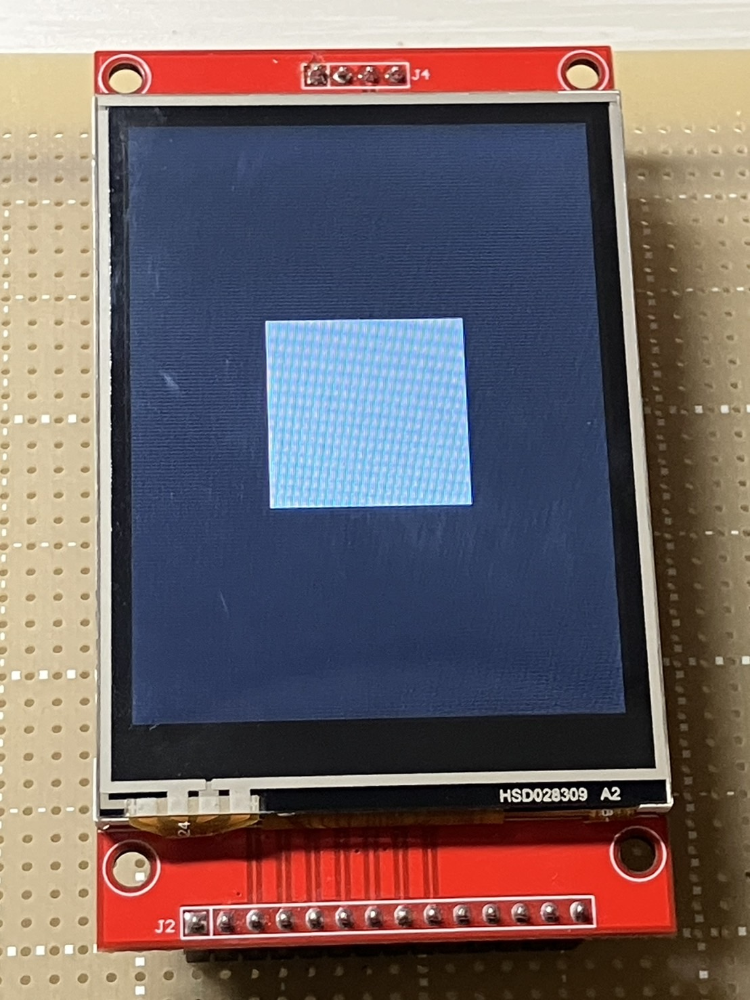
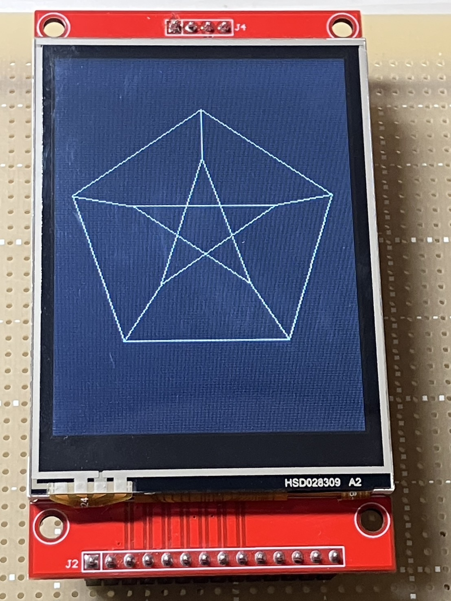
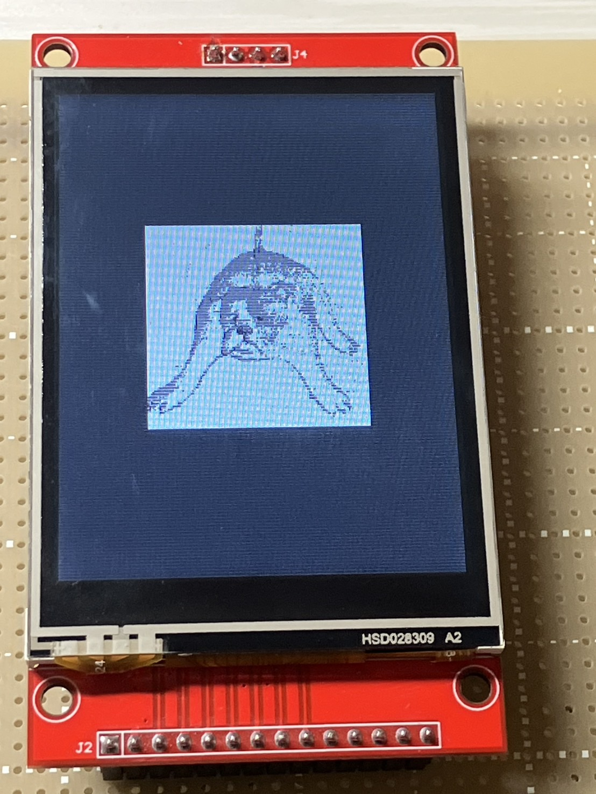
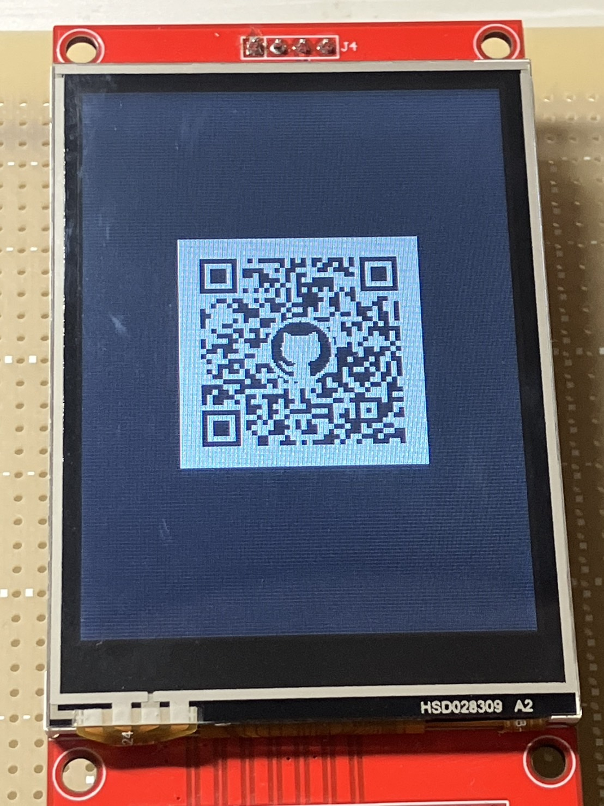
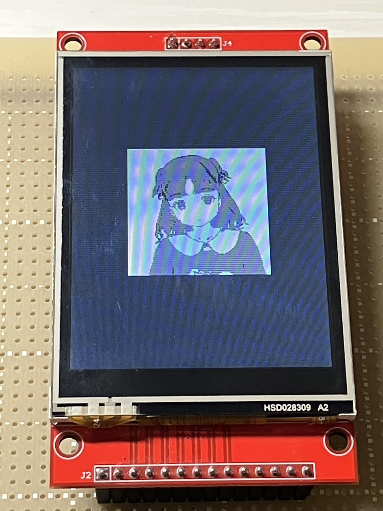
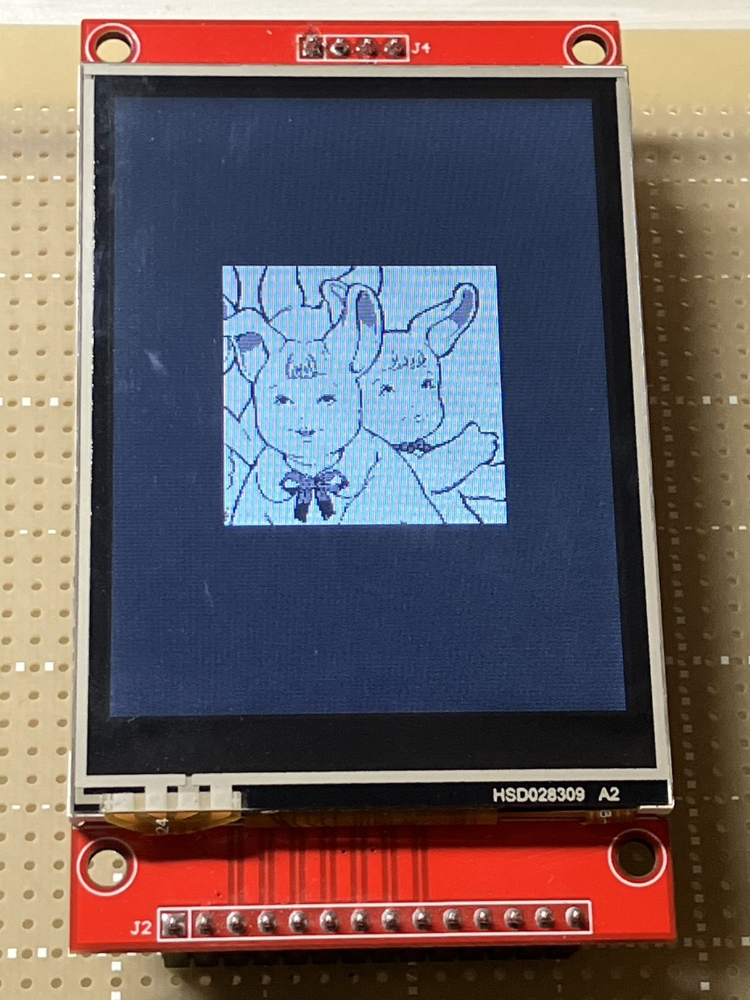

# FPGA_SPI_Display

このプロジェクトは、 **Tang Nano 9K** を使用して、**MSP2807** とSPI通信を行うものです。  
現在、画像の描画まで実装しており、今後もアップデートを予定しています。

## MSP2807とは
2.8インチのTFT液晶ディスプレイモジュールです。このモジュールは、4線式SPIインターフェースを使用しており、ILI9341ドライバICを搭載しています。  
このプロジェクトで使用する予定はありませんが、タッチスクリーン機能やSDカードスロットも利用可能です。

## ファイル構成
このプロジェクトの主要なディレクトリとファイルの構成について説明します。

### `draw_square/`
- **概要**: 正方形を描画するための実装が含まれています。
- **主なファイル**
  - `tb/` : テストベンチ
  - `verilog/SPI_cmd.v` : コマンドの送信を行うモジュール
  - `verilog/SPI_data.v` : 16bitのデータの送信を行うモジュール
  - `verilog/SPI_data_8.v` : 8bitのデータの送信を行うモジュール
  - `verilog/SPI_init.v` : 初期化を行うモジュール
  - `verilog/SPI_clear.v` : クリア（ディスプレイを黒く塗りつぶす）を行うモジュール
  - `verilog/SPI_square.v` : 正方形を描画するモジュール
  - `verilog/SPI_top.v` : トップモジュール
  - `square.cst` : 物理制約ファイル
  - `square.sdc` : タイミング制約ファイル

### `draw_petersen_graph/`
- **概要**: ペテルセングラフを描画するための実装が含まれています。
- **主なファイル**
  - `tb/` : テストベンチ
  - `verilog/SPI_cmd.v` : コマンドの送信を行うモジュール
  - `verilog/SPI_data.v` : 16bitのデータの送信を行うモジュール
  - `verilog/SPI_data_8.v` : 8bitのデータの送信を行うモジュール
  - `verilog/SPI_horizontal.v` : x軸に平行な線を描画するモジュール
  - `verilog/SPI_vertical.v` : y軸に平行な線を描画するモジュール
  - `verilog/SPI_line.v` : dx > dyとなる線を描画するモジュール
  - `verilog/SPI_line2.v` : dx < dyとなる線を描画するモジュール
  - `verilog/SPI_init.v` : 初期化を行うモジュール
  - `verilog/SPI_clear.v` : クリア（ディスプレイを黒く塗りつぶす）を行うモジュール
  - `verilog/SPI_pentagon.v` : 正五角形を描画するモジュール
  - `verilog/SPI_star.v` : 正五角形の内側に星を描画するモジュール
  - `verilog/SPI_connect.v` : 正五角形と星の各頂点を結ぶモジュール
  - `verilog/SPI_top.v` : トップモジュール
  - `petersen_graph.cst` : 物理制約ファイル
  - `petersen_graph.sdc` : タイミング制約ファイル

### `draw_picture/`
- **概要**: 画像を描画するための実装が含まれています。
  Gowin EDAのIP Coreを使用して、画像データの取り扱いを行っています。詳細は`draw_picture/README.md`に記述しています。
- **主なファイル**
  - `data/` : 表示する画像、変換コードを格納
  - `tb/` : テストベンチ
  - `verilog/SPI_cmd.v` : コマンドの送信を行うモジュール
  - `verilog/SPI_data.v` : 16bitのデータの送信を行うモジュール
  - `verilog/SPI_data_8.v` : 8bitのデータの送信を行うモジュール
  - `verilog/SPI_init.v` : 初期化を行うモジュール
  - `verilog/SPI_clear.v` : クリア（ディスプレイを黒く塗りつぶす）を行うモジュール
  - `verilog/SPI_picture.v` : 画像を描画するモジュール
  - `verilog/SPI_top.v` : トップモジュール
  - `picture.cst` : 物理制約ファイル
  - `picture.sdc` : タイミング制約ファイル

## 実装内容とコード

### ディスプレイに正方形を描画
- `draw_square/` ディレクトリ に実装されています。

白色の正方形をディスプレイに描画した様子を以下に示します。

  

### ディスプレイにペテルセングラフを描画
- `draw_petersen_graph/` ディレクトリ に実装されています。

白色のペテルセングラフをディスプレイに描画した様子を以下に示します。

  

### ディスプレイに画像を描画
- `draw_picture/` ディレクトリ に実装されています。

画像をディスプレイに描画した様子を以下に示します。本来、ILI9341ディスプレイには1ピクセルあたり RGB565（16bit）形式 のデータを送信する必要がありますが、RGB565形式で送信した場合には正しく描画されませんでした。

そのため今回は、試験的に RGB888（24bit）形式 による送信を行いました。
ただし、ILI9341はRGB888に正式対応していないため、色が正しく表示されず、想定外の色となりました。

この問題への対処として、扱う色を 3色 に限定することで、色の誤差を抑えながら画像の表示を試みました。

なお、正方形やペテルセングラフのような単色の描画の場合は、色の正確さをあまり意識する必要がなかったため、この問題を解くに考慮せずに、単純にデータを送信するだけで済んでいました。

私のアイコンをディスプレイに表示

  

このリポジトリのQRコードをディスプレイに表示

  

女の子のイラストをディスプレイに表示

  

ウサギのイラストをディスプレイに表示

  

女の子・ウサギのイラストは、[@shigaaaan](https://www.instagram.com/shigaaaan)（Instagram）より許可を得て使用しています。

## 問題と課題
- `draw_square/` では、合成時に警告が1つ出ています。
- `draw_petersengraph/` では、**logical loop** に関する多数の警告が出ています。
- `draw_picture/`で表示される画像は色が想定されているものとは異なります。

## 今後のアップデート予定
- 画像の描画精度の向上（現在は色がおかしいなどの問題あり）
- ファイルの整理（機能が重複しているファイルがあるため）
- 警告の解決

## 参考
このプロジェクトでは、コマンドおよびデータ送信のタイミングの参考として、
MITライセンスで公開されている [rdagger/micropython-ili9341](https://github.com/rdagger/micropython-ili9341) の `ili9341.py` を参照しました。